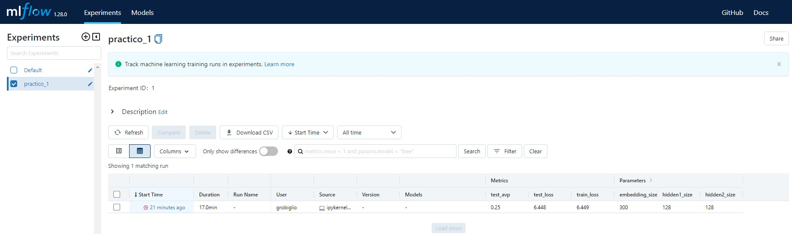

# Deep Learning - Trabajo Práctico 1

[Enunciado](https://github.com/DiploDatos/AprendizajeProfundo/blob/master/Practico.md) del trabajo práctico.

**Implementación de red neuronal [Perceptrón Multicapa](https://en.wikipedia.org/wiki/Multilayer_perceptron) (MLP).**

## Docentes

|Nombre|Dirección de correo electrónico|
|------|-------------------------------|
|Johanna Frau|johannafrau18@gmail.com|
|Mauricio Mazuecos|mmazuecos@mi.unc.edu.ar|

## Integrantes

|Nombre|Dirección de correo electrónico|
|------|-------------------------------|
|Mauricio Caggia|mauriciocaggia@gmail.com|
|Luciano Monforte|luciano.monforte@gmail.com|
|Gustavo Venchiarutti|gustavo.venchiarutti@gmail.com|
|Guillermo Robiglio|grobiglio@mi.unc.edu.ar|

Para una mejor comprensión del funcionamiento del código y la lógica del tratamiento de datos que han de ser utilizados para el entrenamiento de una red neuronal, este trabajo práctico se dividió en tres partes:

- [01-practico1.ipynb](01-practico1.ipynb): **Análisis de datos**. En esta primera parte del trabajo práctico se realiza un análisis de los datos y reducción de los mismos para facilitar el manupuleo durante el armado de los datasets.
- [02-practico1.ipynb](02-practico1.ipynb): **Preprocesamiento de datos**. En esta segunda parte se preprocesan los datos y se los guarda para ser utilizados en la tercera parte, en la que se arma el dataset y se entrena y prueba el modelo. La razón por la que el preprocesamiento se realizó en forma secuencial obedece a la necesidad de poder visualizar el aspecto de los datos en la medida en que estos se fueron procesando. Además, esto ayudó a entender el comportamiento de los módulos utilizados de *gensim*.
- [03-practico1.ipynb](03-practico1.ipynb): **Armado de Datasets y entrenamiento del modelo**. En esta tercera parte se arman los datasets, los dataloaders y se entrena y prueba el modelo.

NOTA 1: Existe un módulo llamado [practico1_modulo.py](practico1_modulo.py) que contiene las siguientes clases y funciones:
- MeLiChallengeDataset (clase)
- MeLiChallengeClassifier (clase)
- procesar_titulo (función)

Este módulo es utilizado en la segunda y tercera parte del práctico.

NOTA 2: Los archivos involucrados en este práctico, a saber:
- meli-challenge-2019/spanish.train.jsonl.gz
- meli-challenge-2019/spanish.test.jsonl.gz
- meli-challenge-2019/spanish.validation.jsonl.gz
- meli-challenge-2019/spanish_token_to_index.json.gz
- training_set.csv
- test_set.csv
- validation_set.csv
- SBW-vectors-300-min5.txt.bz2
- diccionario.txt
- X_train.pt
- y_train.pt
- X_test.pt
- y_test.pt
- embeddings_matrix.pt

Se encuentran en una carpeta `data` que no ha sido subida al repositorio remoto por cuestión de tamaño de los archivos.

## Obstáculos:

No logramos entrenar la red neuronal porque la salida de la misma no se puede comparar con el target.
- El target es un valor entero.
- La salida es un vector de 632 elementos decimales.

Sin embargo, el código funciona y logramos comprender la lógica de Pytorch y el Procesamiento del Lenguaje Natural.

## Mlflow

Captura de pantalla de mlflow.
